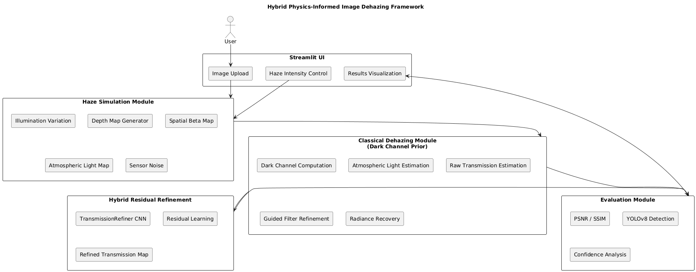

# Hybrid Physics-Informed Image Dehazing and Object Detection Framework

## Overview

This project presents a **Hybrid Image Dehazing Framework** that integrates:

- Classical **Dark Channel Prior (DCP)**
- Spatially varying atmospheric scattering simulation
- Residual CNN-based transmission refinement
- Downstream object detection robustness evaluation using YOLOv8
- Interactive Streamlit-based demonstration interface

The system combines physics-based atmospheric modeling with deep learning to enhance image restoration quality and improve detection performance under severe haze conditions.

---

## Problem Statement

Haze significantly degrades image quality and reduces the reliability of computer vision systems such as object detectors.

Traditional dehazing approaches:
- Assume uniform atmospheric light
- Assume global scattering coefficients
- Fail under spatially varying haze

Deep learning approaches:
- Require large real-world paired datasets
- Lack physical interpretability

This project proposes a hybrid solution that merges classical atmospheric modeling with learned residual correction.

---

## Key Contributions

- Spatially varying atmospheric haze simulation
- Classical Dark Channel Prior implementation
- Residual CNN for transmission refinement
- Multi-image statistical detection evaluation
- Robustness study under varying haze intensities
- Interactive web-based demo system

---

## System Architecture

The pipeline follows:

Architecture Diagram:

---

## Core Components

### 1. Haze Simulation Module
Implements spatial atmospheric scattering:

I(x) = J(x)t(x) + A(1 − t(x))

Where:
- I(x) = Observed hazy image
- J(x) = Clean image
- t(x) = Transmission map
- A = Atmospheric light

Includes:
- Depth map generation
- Spatial beta scattering map
- Illumination variation
- Sensor noise simulation

---

### 2. Classical Dehazing (Dark Channel Prior)

Steps:
- Dark channel computation
- Atmospheric light estimation
- Transmission estimation
- Guided filtering refinement
- Radiance recovery

Provides physics-based baseline restoration.

---

### 3. Hybrid Residual CNN

A lightweight encoder-decoder network that learns:

Residual correction Δt(x)

Final transmission:

t_refined(x) = t_classical(x) + Δt(x)

This improves:
- Edge preservation
- Local atmospheric consistency
- Structural fidelity

---

### 4. Detection Evaluation

Uses pretrained YOLOv8 for:

- Object detection confidence analysis
- Robustness measurement
- Downstream perception validation

The detector is used as an evaluation tool, not as the primary contribution.

---

## Experimental Results Summary

Under severe haze:

- Detection confidence drops significantly.
- Classical DCP partially recovers detection.
- Hybrid refinement improves robustness.
- Hybrid shows measurable confidence gain over classical.
- Improvement increases with haze severity.

The system demonstrates that hybrid dehazing enhances both perceptual quality and detection reliability.

Architecture Diagram:

---

## Core Components

### 1. Haze Simulation Module
Implements spatial atmospheric scattering:

I(x) = J(x)t(x) + A(1 − t(x))

Where:
- I(x) = Observed hazy image
- J(x) = Clean image
- t(x) = Transmission map
- A = Atmospheric light

Includes:
- Depth map generation
- Spatial beta scattering map
- Illumination variation
- Sensor noise simulation

---

### 2. Classical Dehazing (Dark Channel Prior)

Steps:
- Dark channel computation
- Atmospheric light estimation
- Transmission estimation
- Guided filtering refinement
- Radiance recovery

Provides physics-based baseline restoration.

---

### 3. Hybrid Residual CNN

A lightweight encoder-decoder network that learns:

Residual correction Δt(x)

Final transmission:

t_refined(x) = t_classical(x) + Δt(x)

This improves:
- Edge preservation
- Local atmospheric consistency
- Structural fidelity

---

### 4. Detection Evaluation

Uses pretrained YOLOv8 for:

- Object detection confidence analysis
- Robustness measurement
- Downstream perception validation

The detector is used as an evaluation tool, not as the primary contribution.

---

## Experimental Results Summary

Under severe haze:

- Detection confidence drops significantly.
- Classical DCP partially recovers detection.
- Hybrid refinement improves robustness.
- Hybrid shows measurable confidence gain over classical.
- Improvement increases with haze severity.

The system demonstrates that hybrid dehazing enhances both perceptual quality and detection reliability.

Installation
1. Clone Repository
git clone https://github.com/YOUR_USERNAME/Hybrid-Dehazing-Detection.git
cd Hybrid-Dehazing-Detection
2. Create Virtual Environment (Recommended)

Windows:

python -m venv venv
venv\Scripts\activate

Linux / Mac:

python3 -m venv venv
source venv/bin/activate
3. Install Dependencies
pip install -r requirements.txt
Running the Project
Multi-Image Detection Evaluation
python main.py

This performs:

Synthetic haze generation

Classical Dark Channel Prior restoration

Hybrid residual CNN refinement

YOLO detection evaluation

Statistical confidence analysis

Run Interactive Web Application
streamlit run app.py

The web interface allows:

Uploading an image

Adjusting haze intensity

Viewing classical vs hybrid comparison

Interactive before/after slider

Transmission map visualization

Detection confidence analysis

Optional PSNR / SSIM computation

Downloading hybrid output

Evaluation Metrics
Image Quality Metrics

PSNR (Peak Signal-to-Noise Ratio)

SSIM (Structural Similarity Index)

Detection Metrics

Average detection confidence

Hybrid vs Classical confidence gain

Robustness under varying haze intensity

Project Structure
Hybrid-Dehazing-Detection/
│
├── app.py                     # Streamlit demo interface
├── main.py                    # Multi-image evaluation pipeline
├── architecture.png           # System architecture diagram
├── requirements.txt
├── README.md
├── .gitignore
│
├── models/
│   ├── classical/
│   ├── cnn_refiner/
│   ├── synthetic/
│   └── detection/
│
├── evaluation/
│
├── data/
│   └── raw/                   # Sample input images
│
└── results/                   # Generated outputs (ignored in Git)
Technical Highlights

Physics-informed atmospheric modeling

Residual learning for transmission correction

Lightweight encoder-decoder CNN

Spatial haze simulation

Robustness-focused evaluation

Modular, reproducible architecture

Clean engineering structure

Why Hybrid Works

Classical DCP assumes:

Global atmospheric light

Uniform haze distribution

Under severe or spatially varying haze, these assumptions break.

The hybrid model:

Learns residual correction

Preserves structural consistency

Maintains detector compatibility

Prevents catastrophic over-enhancement

Limitations

Synthetic haze may not perfectly match real-world atmospheric conditions

Extremely severe haze may still degrade detection performance

The CNN was trained on synthetic data only

Future Improvements

Real-world haze dataset training

Lightweight mobile deployment

Domain adaptation for real haze

End-to-end joint dehazing-detection training

Edge-device optimization

Real-time video integration

Author

Your Name
Final Year Project
Computer Science / AI Specialization

License

This project is developed for academic purposes.
You may adapt and extend it for research or educational use.

Acknowledgment

This work integrates classical atmospheric scattering models with modern deep learning techniques to improve robustness of computer vision systems under adverse environmental conditions.